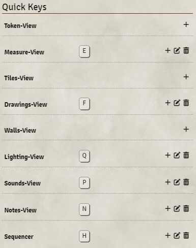

  [](https://patreon.com/SyriousWorkshop)

[Discord](https://discord.gg/VMqndcyUGS)

# Quick Keys
With this module, you can press and hold the hotkey to switch to the corresponding UI view, e.g. lighting, sounds, notes, drawings etc. 
Releasing the key lets you switch back to the view you came from.

Especially useful to quickly toggle lights.

#### Pinning the view
Tapping quickly three times the same key pins the corresponding view.

## Configuration
You can customize the keys in "Configure Controls" 

## Settings
You can set the delay for the 3-tap pinning in the setting. Default is 500.

## API
You can register your module with quick-keys.
Quick keys uses the `data-control` attribute. To add a quick key for your module, use the following
```javascript
game.modules.get("quick-keys").api.registerKey("data-control", "Name that gets displayed in Configure Controls", "The Key");
```

Here's we use sequencer as an example. The data-control attribute within the DOM is "sequencer" and we register the "H" key.

```javascript
Hooks.once('setup', async () => {
    game.modules.get("quick-keys").api.registerKey("sequencer", "Sequencer", "KeyH");
});
```



### Support
If you like to support my work find me on [Patreon](https://www.patreon.com/SyriousWorkshop).
